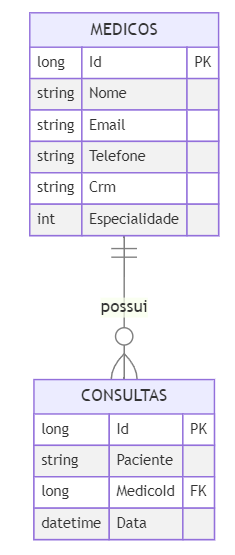

# Projeto ASP.NET Core - MedVoll.Web

Este é um projeto ASP.NET Core MVC desenvolvido para gerenciar médicos e consultas médicas. Abaixo estão descritos os principais componentes da estrutura do projeto e como eles funcionam em conjunto.

## Executando o Projeto

Para inicializar o projeto **MedVoll.Web** com o banco de dados configurado, é necessário executar o comando:

```
dotnet ef database update
```

Esse comando aplica as migrações pendentes ao banco de dados, criando as tabelas e estruturas definidas nas classes de migração dentro da pasta *Migrations*. Assim, ao rodar o comando, você garante que o banco de dados esteja atualizado e compatível com o código atual do projeto, possibilitando o funcionamento correto das operações de leitura e escrita necessárias para a aplicação.

Para compilar e rodar um projeto ASP.NET Core, use o comando:

```bash
dotnet run
```

## Estrutura das Tabelas



As tabelas medicos e consultas foram criadas para gerenciar dados médicos e de consultas em um sistema de agendamento. A tabela medicos armazena informações dos médicos, incluindo Id, Nome, Email, Telefone, Crm (registro profissional) e Especialidade. Cada médico pode ter várias consultas associadas, mas uma consulta está associada a apenas um médico.

A tabela consultas contém as consultas realizadas, com os campos Id, Paciente (nome do paciente), MedicoId (chave estrangeira que referencia Id em medicos) e Data (data da consulta). A relação entre medicos e consultas é de um-para-muitos, onde um médico pode ter várias consultas, e o campo MedicoId em consultas referencia o médico responsável pela consulta.

## Estrutura do Projeto

A estrutura do projeto está organizada conforme as boas práticas de desenvolvimento em camadas. Abaixo, você encontrará uma breve descrição de cada pasta e dos arquivos que compõem o projeto.

### Arquivos Principais

- **Program.cs**: Configura e inicializa o aplicativo ASP.NET Core. Define os serviços, middlewares e configurações essenciais para o funcionamento do aplicativo.

### Pastas

#### Controllers

Contêm os controladores, responsáveis por processar as requisições HTTP, manipular dados e definir qual resposta será enviada ao cliente.

- **BaseController.cs**: Um controlador base que pode incluir funcionalidades compartilhadas por outros controladores.
- **ConsultaController.cs**: Controlador para gerenciar as operações relacionadas às consultas médicas (listar, agendar, editar, etc.).
- **ErroController.cs**: Controlador que gerencia as respostas para erros e fornece uma experiência de erro personalizada.
- **HomeController.cs**: Controlador principal que gerencia as páginas iniciais do aplicativo.
- **MedicoController.cs**: Controlador para gerenciar as operações relacionadas aos médicos (cadastrar, listar, editar, excluir).

#### Dtos (Data Transfer Objects)

Contém classes utilizadas para transferir dados entre camadas do sistema sem expor diretamente os modelos de dados.

- **ConsultaDto.cs**: DTO que representa os dados de uma consulta para transferências e exibições.
- **EnumExtensions.cs**: Extensões para lidar com tipos de enumeração usados em DTOs.
- **IPaginatedList.cs / PaginatedList.cs**: Interface e implementação de uma lista paginada, usada para resultados paginados.
- **MedicoDto.cs**: DTO que representa os dados de um médico.

#### Exceptions

Contém classes para tratamento de exceções específicas.

- **RegraDeNegocioException.cs**: Exceção personalizada para regras de negócio, usada para centralizar validações e garantir a integridade do sistema.

#### Filters

Contém filtros personalizados para tratamento de erros e exceções.

- **ExceptionHandlerFilter.cs**: Filtro global para captura e manipulação de exceções, melhorando a experiência do usuário e padronizando respostas de erro.

#### Interfaces

Define interfaces para os repositórios e serviços, aplicando o princípio da inversão de dependência.

- **IConsultaRepository.cs / IMedicoRepository.cs**: Interfaces para os repositórios de consultas e médicos, respectivamente, que definem os métodos de acesso aos dados.
- **IConsultaService.cs / IMedicoService.cs**: Interfaces para os serviços de consultas e médicos, responsáveis pela lógica de negócios.

#### Migrations

Contém os arquivos de migração gerados pelo Entity Framework Core para criação e atualização do banco de dados.

- Arquivos como `20241107014609_CreateMedicosConsultasTables.cs` definem as operações para criar ou modificar tabelas, aplicando mudanças no banco de dados conforme necessário.

#### Models

Contém as classes de modelo que representam as entidades do sistema.

- **ApplicationDbContext.cs**: Contexto do Entity Framework, gerencia a conexão com o banco de dados e define as tabelas de `Medico` e `Consulta`.
- **Consulta.cs / Medico.cs**: Modelos que representam as entidades de consulta e médico no banco de dados.
- **ErrorViewModel.cs**: Modelo de erro para representação de mensagens de erro.
- **Especialidade.cs**: Representa as especialidades médicas.

#### Repositories

Contém implementações de repositórios, que são responsáveis pelo acesso aos dados e interações com o banco.

- **ConsultaRepository.cs**: Implementação do repositório de consultas, lida com operações de CRUD para consultas.
- **MedicoRepository.cs**: Implementação do repositório de médicos, lida com operações de CRUD para médicos.

#### Services

Contém os serviços que implementam a lógica de negócios.

- **ConsultaService.cs**: Implementação de lógica de negócios para operações de consultas.
- **MedicoService.cs**: Implementação de lógica de negócios para operações de médicos.

### Funcionamento Geral

1. **Injeção de Dependência**: As interfaces para serviços e repositórios são injetadas nos controladores via injeção de dependência, promovendo a separação de responsabilidades e facilitando os testes.

2. **Fluxo de Requisição**: O controlador recebe uma requisição HTTP, chama o serviço apropriado para manipular a lógica de negócios e, em seguida, utiliza um repositório para acessar o banco de dados. Os dados são formatados por meio de DTOs e enviados como resposta.

3. **Migrations**: O Entity Framework Core é usado para gerenciar o banco de dados. As migrações facilitam a criação e atualização de tabelas de `Medico` e `Consulta`.

4. **Tratamento de Erros**: O `ExceptionHandlerFilter` captura exceções de negócios e fornece respostas padronizadas para os erros.
